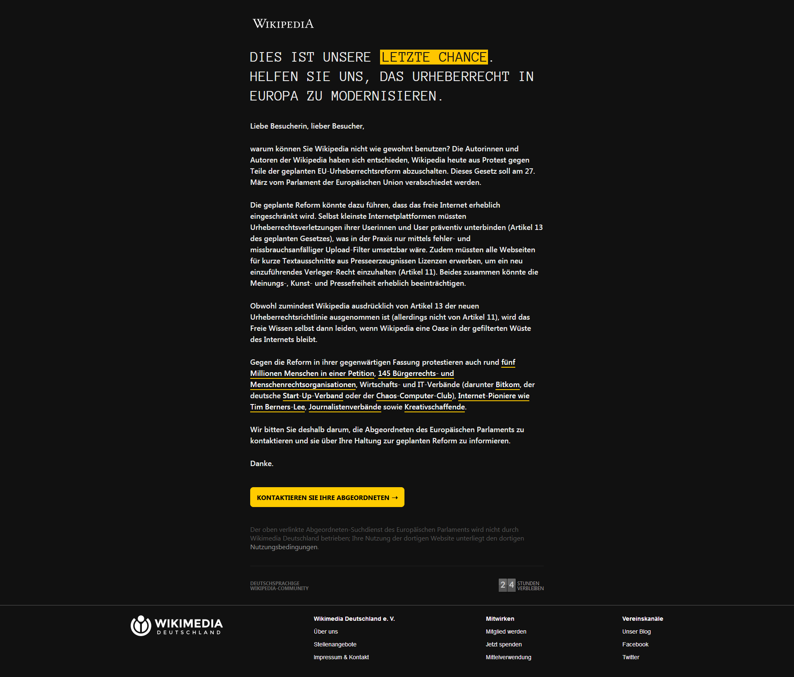
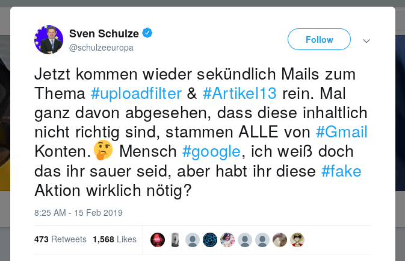
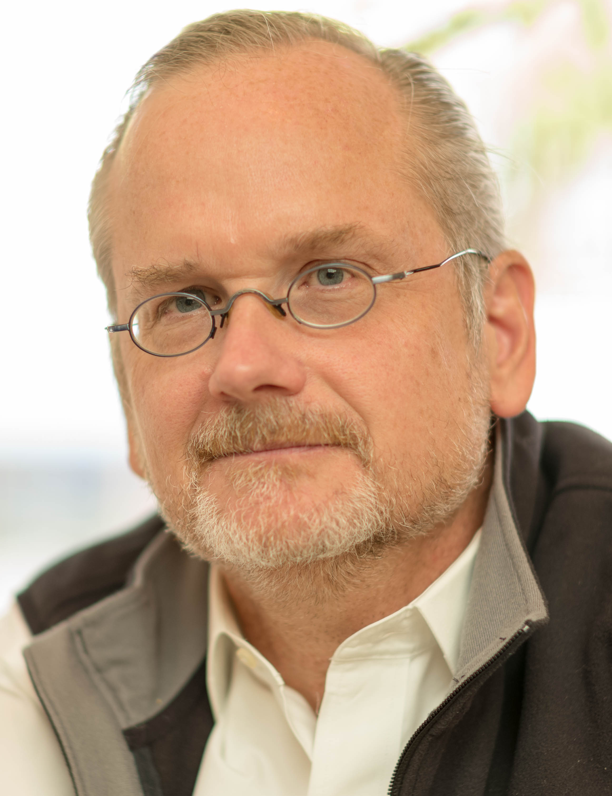
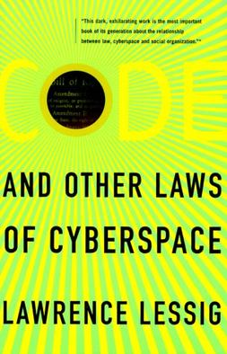
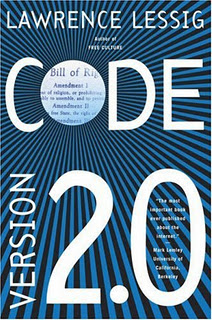
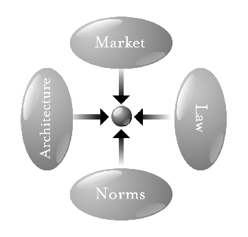

% Intellectual Property, Lessig and the EU Copyright Directive
% Papers We Love Berlin April 2019
% Lusy

---

# EU Copyright Directive

---

> "The European Council (EC) describes their key goals with the Directive as protecting press publications; reducing the "value gap" between the profits made by Internet platforms and by content creators; encouraging collaboration between these two groups, and creating copyright exceptions for text- and data-mining." Source: EN WP

---

## Timeline

    2012 planned revision of 2001 Copyright Directive announced
    Jul 2014 first report on the state of EU copyright published
    14 Sep 2016 first draft of the new directive
    20 Jun 2018 EU Parliament Committee on Legal Affairs
    12 Sep 2018 EU Parliament approves a revised proposal
    13 Feb 2019 final version after trilogue meetings
    26 Mar 2019 EU Parlament votes in favour
    15 Apr 2019 directive approved by the EU Council
    2 year period for Member states to pass appropriate legislation

---

<small>Markus Göllnitz https://commons.wikimedia.org/wiki/User:CamelCaseNick
https://creativecommons.org/licenses/by-sa/4.0/deed.en</small>

---

<small>https://upload.wikimedia.org/wikipedia/commons/c/c5/Blackout_of_wikipedia.de_by_Wikimedia_Deutschland_-_March_2019.png</small>

---

<small>https://twitter.com/schulzeeuropa/status/1096445520770404352)</small>

---

## Draft Article 11 (Article 15): "link tax"

"Google should pay for content they use and generate profit out of"

---

## Draft Article 13 (Article 17): "upload filters"

tasks service providers that host user-generated content to employ "effective and proportionate" measures to prevent users from violating copyright

---

> "Mit der Schrotflinte auf Youtube geschossen, halbes Netz mitgetroffen"

<small>https://netzpolitik.org/2019/chance-verpasst-dieses-urheberrecht-bleibt-in-der-vergangenheit-stecken/</small>

---

## Lawrence Lessig

<small>By Joi Ito - https://www.flickr.com/photos/joi/33668559574/, CC BY 2.0, https://commons.wikimedia.org/w/index.php?curid=59092992</small>

---

## Code and Other Laws of Cyberspace

<small>By Source, Fair use, https://en.wikipedia.org/w/index.php?curid=34070395</small>

---

## Code Version 2.0

<small>By Source, Fair use, https://en.wikipedia.org/w/index.php?curid=34069549</small>

---

## The pathetic dot theory

<small>By Lawrence Lessig - https://www.socialtext.net/data/workspaces/codev2/attachments/what_things_regulate:20061211230426-1-8535/scaled/4constraints.png, CC BY-SA 2.5, https://commons.wikimedia.org/w/index.php?curid=25113167</small>

---

# Chapter 10: Intellectual Property

---

## In a nutshell

> "We are not entering a time when copyright
> is more threatened than it is in real space. We are instead entering a time
> when copyright is more effectively protected than at any time since Gutenberg."

---

"As Jessica Litman
described more than a decade ago,
At the turn of the century, U.S. copyright law was technical, inconsistent, and
difficult to understand, but it didn’t apply to very many people or very many
things. If one were an author or publisher of books, maps, charts, paintings,
sculpture, photographs or sheet music, a playwright or producer of plays, or a
printer, the copyright law bore on one’s business. Booksellers, [...]
musicians, scholars, [...], and ordinary consumers could go about their business
without ever encountering a copyright problem."

---

"the single, defining feature of these norms can perhaps be summarized like
this: that a consumer could do with the copyrighted content that he legally
owned anything he wanted to do, without ever triggering the law of copyright."

---

"Roughly put, copyright gives a copyright holder certain exclusive rights over
the work, including, most famously, the exclusive right to copy the work."

"The right is protected to the extent that laws (and norms) support it,"
"it is threatened to the extent that technology makes it easy to copy."
"In this sense, copyright has always been at war with technology."

---

## Analog vs digital

"Thus there were many ways in which you could use creative work in the
analog world without producing a copy."

"Digital technology, at its core, makes copies."

"There is no way to use any content in a digital
context without that use producing a copy."

---

## Possible regulators

"What means would bring
about the most efficient set of protections for property interests in cyberspace?"

"One is the traditional protection of
law—the law defines a space where others should not enter and punishes
people who enter nonetheless. The other protection is a fence, a technological
device (a bit of code) that (among other things) blocks the unwanted from
entering."

---

"it is hard for the law to distinguish between legitimate and illegiti-
mate uses of cyberspaces"

---

## White Paper 1995

"The White Paper proceeds as if the problem of pro-
tecting intellectual property in cyberspace was just like the problem of
protecting intellectual property in real space.
[...]
But something fundamental has changed: the role that code plays in the
protection of intellectual property. Code can, and increasingly will, displace
law as the primary defense of intellectual property in cyberspace. Private
fences, not public law."

---

# DMCA 1998

"Code that some-
one implements to control either access to or use of a copyrighted work got
special legal protection under the DMCA: Circumvention of that code, subject
to a few important exceptions, constituted a violation of the law."

---

## Law vs contracts vs code

"As Stefik writes:
[T]he consumer does not have the option of
disregarding a digital contract by, for example, making unauthorized copies of
a work."

---

"An important point about copyright law is that, though designed in part
to protect authors, the control it was designed to create was never to be per-
fect." (p.179)
"As the Supreme Court noted, copyright “protection has never accorded
the copyright owner complete control over all possible uses of his work.” 18
Thus, the law grants only particular exclusive rights, and those rights are sub-
ject to important limitations, such as “fair use,” limited terms, and the first sale
doctrine."
"the law was never designed to simply do the author’s bidding. It had pub-
lic purposes as well as the author’s interest in mind." //cmp Copyright Directive

---

"What copyright seeks to do using the threat of law and the push of norms,
trusted systems do through the code."
"The controls needed to reg-
ulate this access are built into the systems, and no users (except hackers) have
a choice about whether to obey them."
"Trusted systems in this sense are a privatized alternative to copyright law."

---

"Private law creates private rights to the extent that these private rights
serve some collective good. If a private right is harmful to a collective good,
then the state has no reason to create it." (p.180)

---

"If the law did not
protect authorship at all, there would be fewer authors." (p.183)
// cmp motivation Copyright Directive

---

"Increasing intel-
lectual property’s protection is not guaranteed to “promote the progress of
science and useful arts”—indeed, often doing so will stifle it."

---

"So copyright law strikes a balance between control and access. What about
that balance when code is the law? Should we expect that any of the limits will
remain? Should we expect code to mirror the limits that the law imposes?
Fair use? Limited term? Would private code build these “bugs” into its protec-
tions?" (p.185)
"The point should be obvious: When intellectual property is protected by
code, nothing requires that the same balance be struck. Nothing requires the
owner to grant the right of fair use."

---

"As I mentioned above, the DMCA contains an anti-circumvention provision.
That part of the law forbids the circumvention of some technical protection
measures; it forbids the development of tools to circumvent technical protec-
tion as well. Most important, it forbids these circumventions regardless of
the purpose of the circumvention. Thus, if the underlying use you would
make of a copyrighted work—if you could get access to it—is a “fair use,” the
DMCA still makes it an offense to circumvent technical protections to get
access to it. Thus one part of the law of copyright grants “fair use,” while
another part of copyright removes at least some fair use liberty where the
fair use has been removed by technical means. 38" (p.186)

---

But maybe this conflict is just temporary. Couldn’t the code be changed
to protect fair use?
The answer to that hopeful (and again, hopeful because my main point is
about whether incentives to protect fair use exist) question is no, not directly.
Fair use inherently requires a judgment about purpose, or intent. That judg-
ment is beyond the ken of even the best computers." (p.187)
//cmp article 13

---

"As Stefik writes, trusted systems “differ
from an ordinary contract in critical ways.”
[I]n an ordinary contract, compliance is not automatic;"(p.188)

---

"The balance struck by the law
was the best that authors could get. But now, code gives authors a better deal.
The question for legal policy is whether this better deal makes public sense."
"Here we confront the first latent ambiguity within the law of copyright."

---

Fair use:
"Were these transactions left free because it
was too costly to meter them? Or were these transactions left free because
keeping them free was an important public value tied to copyright?" (p.189)

---

right to read anonymously
"we must ask whether the latent right
to read anonymously, given to us before by imperfections in technologies,
should be a legally protected right." (p.191)
right to read anonymously
"we must ask whether the latent right
to read anonymously, given to us before by imperfections in technologies,
should be a legally protected right." (p.191)

---

"She argues that there is a right to resist, or
“hack,” trusted systems to the extent that they infringe on traditional fair use.
(Others have called this the “Cohen Theorem.”)"

---

"Now if all you think about is protecting the distribution of professionally
created culture, this might not concern you much. If you’re trying to stop
“piracy,” then a regime that says every use requires permission is a regime
that gives you a fairly broad range of tools for stamping out piracy."
"just now, in fact, protecting the distribution of profes-
sionally created culture is not the only, or even, I suggest, the most
important part of culture. And indeed, from a historical perspective, top-
down, professionally produced culture is but a tiny part of what makes
any culture sing."

---

"Standing alongside professional culture is amateur culture—where ama-
teur doesn’t mean inferior or without talent, but instead culture created by
people who produce not for the money, but for the love of what they do."

"Importantly, too, this kind of cultural remix has historically been free of
regulation." (p.194)

---

"All this has now changed, and digital technologies are responsible. First,
and most important, digital technologies have radically expanded the scope of
this amateur culture. Now the clever remix of some political event or the
latest song by your favorite band are not just something you can share with
your friends. Digital technologies have made it simple to capture and share
this creativity with the world."
"“Peo-
ple are waking from their consumerist coma,” one commentator describes. 62"

---

"while there is extensive and new
regulation of amateur culture, that regulation creates new wealth for profes-
sional culture. There’s a choice to be made about which form of culture we
should protect."
// EU Copyright Directive takes a clear stance on this one

---

"These three examples reveal a common pattern—one that will reach far
beyond copyright. At one time we enjoyed a certain kind of liberty. But that
liberty was not directly chosen; it was a liberty resulting from the high costs of
control. 65" (p.196)

---

Pending Choices:
- whether to allow intellectual property in effect to
become completely propertized
- whether to allow this regime to
erase the anonymity latent in less efficient architectures of control
- whether
to allow the expansion of intellectual property to drive out amateur culture

---

# Thank you!

These slides are under the [by-sa Creative Commons License](https://creativecommons.org/licenses/by-sa/4.0/).

---

# Questions? Comments? Thoughts?
